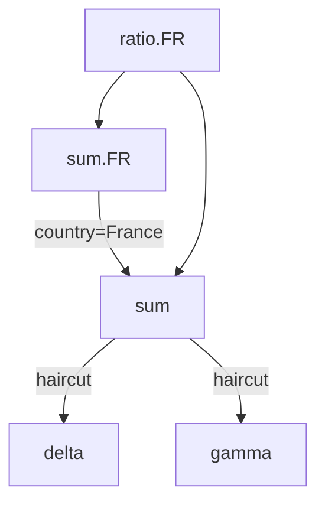

# AdHoc - InMemory Transformation Pipeline

## Motivation

Make it easy to define/code/review a complex pipeline of transformation rules.

- The rules define a DAG/Directed-Acyclic-Graph, going from raw-data to complex measures. Intermediate nodes could also be used as measures.
- The DAG should be easily readable and modifiable but a human, not necessarily a developer.
- The DAG can express simple operations like `SUM` or `PRODUCT`, and complex operations like `GROUPBY`. 

## Related Projects

- SQLServer. We rely on many concepts from SQLServer to define our own abstractions.
- Apache Beam. Though [Beam](https://beam.apache.org/) seems less flexible to access intermediate results as intermediate measures.
- MongoDB [Aggregation Pipeline](https://www.mongodb.com/resources/products/capabilities/aggregation-pipeline).
- [DAX](https://learn.microsoft.com/en-us/dax/dax-overview) enables complex queries in Microsoft eco-system.
- [SquashQL](https://www.squashql.io/) is an SQL query-engine for OLAP, with a strong emphasis on its typescript UI.
- [Atoti PostProcessors](https://docs.activeviam.com/products/atoti/server/6.1.1/docs/cube/postprocessors/)

# Concepts

## AdhocQuery

An `AdhocQuery` is similar to a `SELECT ... WHERE ... GROUP BY ...` SQL statement. It is defined by:

- a list of `groupBy` columns.
- a set of `filter` clauses.
- a list of measures, being either aggregated or transformed measures.

## Database

Adhoc is not a database, it is a query engine. It knows how to execute complex KPI queries, typically defined as complex graph of logics. The leaves of these graphes are simpler measures, to be provided by external databases.

Typical database are:

- CSV or Parquet files: Adhoc recommends querying local/remote CSV/Parquet files through [DuckDb](https://duckdb.org/), with the [JooqSqlDatabase](JooqSqlDatabase).
- Any SQL database: you should rely on [JooqSqlDatabase](JooqSqlDatabase), possibly requiring a [Professional or Enterprise JooQ license](https://www.jooq.org/download/#databases).
- ActivePivot/Atoti

## Measures 

A measure can be:
- an aggregated measure (a column aggregated by an aggregation function)
- an transformed measure (one or multiple measures are mixed together, possibly with additional `filter` and/or `groupBys`).

Measures defines a Directed-Acyclic-Graph, where leaves are aggregated measures and nodes are transformed measures. The DAG is typically evaluated on a per-query basis, as the AdhocQuery `groupBy` and `filter` has to be combined with the own measures `groupBys` and `filters`.

## Node granularity

Measures are evaluated for a coordinate, defined by the `groupBy` and the `filter` of its parent node. The root node have they `groupBy` and `filter` defined by the AdhocQuery.

- Combinator neither change the `groupBy` nor the `filter`.
- Filtrator adds a `filter`, AND-ed with node own `filter`.
- Bucketor adds a `groupBy`, UNION-ed with node own `groupBy`.

### Aggregation Functions

Aggregations are used to reduce input data up to the requested (by `groupBys`) granularity. Multiple aggregation functions may be applied over the same column.

See https://support.microsoft.com/en-us/office/aggregate-function-43b9278e-6aa7-4f17-92b6-e19993fa26df

### Tranformations Measures

On top of aggregated-measures, one can define transformation.

- Combinator: the simplest transformation evaluate a formula over underlying measures. (e.g. `sumMeasure=a+b`).
- Filtrator: evaluate underlying measure with a coordinate when the filter is enforced. The node `filter` is AND-ed with the `measure` filter. Hence, if the query filters `country=France` and the filtrator filters `country=Germany`, then the result is empty.
- Bucketor: evaluates the underlying measures with an additional groupBy, then aggregates up to the node granularity.
- Dispatchor: given an cell, it will contribute into multiple cells. Useful for `many-to-many` or `rebucketing`.

# Many-to-many

In Analysis-Services, [Many-to-Many](https://github.com/MicrosoftDocs/bi-shared-docs/blob/main/docs/analysis-services/multidimensional-models/define-a-many-to-many-relationship-and-many-to-many-relationship-properties.md) is a feature enabling a fact (i.e. an input row) to contribute into multiple coordinate of a given column.

For instance, in a flatten `GeographicalZone` column (e.g. having flattened a hierarchical `Region->Country->City`), a single `Paris` fact would contribute into `Paris`, `France` and `Europe`.

This can be achieved in Adhoc with a `Dispatchor`.