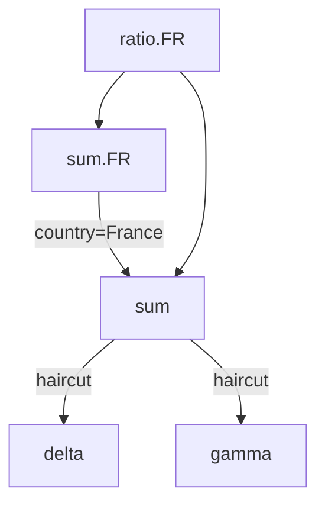

# AdHoc - InMemory Transformation Pipeline

## Motivation

Make it easy to define/code/review a complex pipeline of transformation rules.

- The rules define a DAG/Directed-Acyclic-Graph, going from raw-data to complex measures. Intermediate nodes could also be used as measures.
- The DAG should be easily readable and modifiable but a human, not necessarily a developer.
- The DAG can express simple operations like `SUM` or `PRODUCT`, and complex operations like `GROUPBY`. 

### About performance

Humans are generally happier when things goes faster. `Adhoc` enables split-second queries over the underlying table. The table pre-aggregation is generally the slow-part of a full `AdhocQuery` query. hence, we do not target absolute performance in `Adhoc`. In other words, we prefer things to remains slower, as long as it enables this project to remains simpler, given a query is generally slow due to the underlying table.

Concurrency: as of `0.0.2`, `Adhoc` is fully mono-threaded. Parts of the engines would be multi-theaded at some point. Please report specific slow cases so they can be optimized the proper way.

## Related Projects

- SQLServer. We rely on many concepts from SQLServer to define our own abstractions.
- Apache Beam. Though [Beam](https://beam.apache.org/) seems less flexible to access intermediate results as intermediate measures.
- MongoDB [Aggregation Pipeline](https://www.mongodb.com/resources/products/capabilities/aggregation-pipeline).
- [DAX](https://learn.microsoft.com/en-us/dax/dax-overview) enables complex queries in Microsoft eco-system.
- [SquashQL](https://www.squashql.io/) is an SQL query-engine for OLAP, with a strong emphasis on its typescript UI.
- [Atoti PostProcessors](https://docs.activeviam.com/products/atoti/server/6.1.1/docs/cube/postprocessors/) is the standard Atoti way of building complex tree of measures on top of Atoti cubes.

# Quick-start

## Hardware requirements

RAM: any JVM can run Adhoc, as Adhoc does not store data: it queries on-the-fly the underlying/external tables.
CPU: any JVM can run Adhoc. If multiple cores are available, Adhoc will takes advantage of them. But even a single-core JVM can run Adhoc queries smoothly.

## Set-up

1. Ensure you have JDK 21 available
2. Add a (`maven`/`gradle`) dependency to `eu.solven.adhoc:adhoc:0.0.2` (they are deployed to m2central: https://central.sonatype.com/artifact/eu.solven.adhoc/adhoc)
3. Define an `IAdhocTableWrapper`: it defines how Adhoc can access your data

Assuming your data is queryable with JooQ:

```
myTableWrapper = new AdhocJooqTableWrapper(AdhocJooqTableWrapperParameters.builder()
        .dslSupplier(DuckDbHelper.inMemoryDSLSupplier())
        .table(yourJooqTableLike)
        .build());
```

For local `.parquet` files, it can be done with:

```
myTableWrapper = new AdhocJooqTableWrapper(AdhocJooqTableWrapperParameters.builder()
        .dslSupplier(DuckDbHelper.inMemoryDSLSupplier())
        .table(DSL.table(DSL.unquotedName("read_parquet('myRootFolder/2025-*-BaseFacts_*.parquet', union_by_name=True)")))
        .build());
```

4. Define a `MeasureForest`: it defines the measures and the links between them, through their underlying measures.

An early-stage forest could look like:
```
Aggregator k1Sum = Aggregator.builder().name("k1").aggregationKey(SumAggregator.KEY).build();
Aggregator k2Sum = Aggregator.builder().name("k2").aggregationKey(SumAggregator.KEY).build();

Combinator k1PlusK2AsExpr = Combinator.builder()
        .name("k1PlusK2AsExpr")
        .underlyings(Arrays.asList("k1", "k2"))
        .combinationKey(ExpressionCombination.KEY)
        .combinationOptions(ImmutableMap.<String, Object>builder().put("expression", "IF(k1 == null, 0, k1) + IF(k2 == null, 0, k2)").build())
        .build();

MeasureForest.MeasureForestBuilder forestBuilder = MeasureForest.builder();
forestBuilder.addMeasure(k1Sum);
forestBuilder.addMeasure(k2Sum);
forestBuilder.addMeasure(k1PlusK2AsExpr);
```

5. Defines an Adhoc Engine: it know how to execute a query given the measure relationships

```
AdhocQueryEngine aqe = AdhocQueryEngine.builder().eventBus(AdhocTestHelper.eventBus()).forest(forestBuilder.build()).build();
```

6. Define your query
```
ITabularView view = aqe.execute(AdhocQuery.builder().measure(k1SumSquared.getName()).debug(true).build(), jooqDb);
MapBasedTabularView mapBased = MapBasedTabularView.load(view);

Assertions.assertThat(mapBased.keySet().map(AdhocSliceAsMap::getCoordinates).toList())
        .containsExactly(Map.of());
Assertions.assertThat(mapBased.getCoordinatesToValues())
        .containsEntry(Map.of(), Map.of(k1SumSquared.getName(), (long) Math.pow(123 + 234, 2)));
```

7. Execute your query

# Concepts

## AdhocQuery

An `AdhocQuery` is similar to a `SELECT ... WHERE ... GROUP BY ...` SQL statement. It is defined by:

- a list of `groupBy` columns.
- a set of `filter` clauses.
- a list of measures, being either aggregated or transformed measures.



## Table

Adhoc is not a database, it is a query engine. It knows how to execute complex KPI queries, typically defined as complex graph of logics. The leaves of these graphes are pre-aggregated measures, to be provided by external tables.

Typical tables are:

- CSV or Parquet files: Adhoc recommends querying local/remote CSV/Parquet files through [DuckDb](https://duckdb.org/), with the [JooqSqlTable](JooqSqlTable).
- Any SQL table: you should rely on [JooqSqlTable](JooqSqlTable), possibly requiring a [Professional or Enterprise JooQ license](https://www.jooq.org/download/#databases).
- ActivePivot/Atoti
- Your own Database implementing `IAdhocTableWrapper`

### Transcoder

#### Column Transcoding

Given tables may hold similar data but with different column names. A `IAdhocTableWrapper` enables coding once per table such a mapping.

A default `IAdhocTableWrapper` assumes `IAdhocQuery` columns matches the `IAdhocTableWrapper` columns.

In case of a table with `JOIN`s, one would often encounter ambiguities when querying a field. For instance when:
- querying a field used in a JOIN definition: the same name may appear in multiple tables
- querying joined tables with `*`, but tables have conflicting field names.

In such a case, one can resolve ambiguities by resolving them in a `IAdhocTableWrapper`. For instance:
```java
MapTableTranscoder.builder()
    .queriedToUnderlying("someColumn", "someTable.someColumn")
    .build()
```

#### Value Transcoding

Tables may not all accept query with similar types. Typically, one may filter a column with an `enum` while given `enum` type
may be unknown to the table.

This can be managed with a `ICustomTypeManager`, which will handle type-transcoding on a per-column per-value basis.

## Measures 

A measure can be:
- an aggregated measure (a column aggregated by an aggregation function)
- an transformed measure (one or multiple measures are mixed together, possibly with additional `filter` and/or `groupBys`).

A set of measures defines a Directed-Acyclic-Graph, where leaves are pre-aggregated measures and nodes are transformed measures. The DAG is typically evaluated on a per-query basis, as the AdhocQuery `groupBy` and `filter` has to be combined with the own measures `groupBys` and `filters`.

## Node granularity

Measures are evaluated for a slice, defined by the `groupBy` and the `filter` of its parent node. The root node have they `groupBy` and `filter` defined by the AdhocQuery.

- Combinator neither change the `groupBy` nor the `filter`.
- Filtrator adds a `filter`, AND-ed with node own `filter`.
- Bucketor adds a `groupBy`, UNION-ed with node own `groupBy`.

### Aggregation Functions

Aggregations are used to reduce input data up to the requested (by `groupBys`) granularity. Multiple aggregation functions may be applied over the same column.

See https://support.microsoft.com/en-us/office/aggregate-function-43b9278e-6aa7-4f17-92b6-e19993fa26df

### Expressions as Aggregations

`ExpressionAggregation` enable custom expression for table processing. 

For instance, in DuckDB, one can use the syntax `SUM("v") FILTER color = 'red'`. It can be used as aggregator:

```
Aggregator.builder()
    .name("v_RED")
    .aggregationKey(ExpressionAggregation.KEY)
    .column("max(\"v\") FILTER(\"color\" in ('red'))")
    .build();
```

### Transformators

On top of aggregated-measures, one can define transformators.

- Combinator: the simplest transformation evaluate a formula over underlying measures. (e.g. `sumMeasure=a+b`).
- Filtrator: evaluate underlying measure with a coordinate when the filter is enforced. The node `filter` is AND-ed with the `measure` filter. Hence, if the query filters `country=France` and the filtrator filters `country=Germany`, then the result is empty.
- Bucketor: evaluates the underlying measures with an additional groupBy, then aggregates up to the node granularity.
- Dispatchor: given an cell, it will contribute into multiple cells. Useful for `many-to-many` or `rebucketing`.

# Many-to-many

In Analysis-Services, [Many-to-Many](https://github.com/MicrosoftDocs/bi-shared-docs/blob/main/docs/analysis-services/multidimensional-models/define-a-many-to-many-relationship-and-many-to-many-relationship-properties.md) is a feature enabling a fact (i.e. an input row) to contribute into multiple coordinate of a given column.

For instance, in a flatten `GeographicalZone` column (e.g. having flattened a hierarchical `Region->Country->City`), a single `Paris` fact would contribute into `Paris`, `France` and `Europe`.

This can be achieved in Adhoc with a `Dispatchor`.

A full example is visible in `TestManyToManyAdhocQuery`. It demonstrates how a measure can:

- query underlying measures on fine grained slices (e.g. the input slices of the many-to-many)
- project each of these slices into 0, 1 or N slices (e.g. the output slices of the many-to-many)
- generate its own columns, independently of the underlying table (`IColumnGenerator`). In a many-to-many, the group column is generated by the measure, while the elements are generally generated by the table (or a previous many-to-many).

references:
- [Analysis Services](https://learn.microsoft.com/en-us/analysis-services/multidimensional-models/define-a-many-to-many-relationship-and-many-to-many-relationship-properties)

# Complex Aggregations (e.g. arrays for Value-at-Risk)

For for needs, the aggregation applies not over doubles or longs, but complex objects. For `Value-at-Risk`, the aggregated object is a `double[]` of constant length.

An example for such a use-case is demonstrated in `TestTableQuery_DuckDb_VaR`.

The ability to decompose along the scenarioIndex, or a scenarioName column, which are not defined in the table (which should provide one `double[]` per row) is achieved with a `Dispatchor`. Indeed, it can be seen as a `1-row-to-many-scenarioIndexes`.

# Limitations

## Visual filters

Sometimes, one wants to filter the visible members along some columns, without filtering the actual query. Typically, one may want
to query the ratio `France/Europe` by filtering the `France` country, without restricting `Europe` to `France`-only. For now, this can not be easily done.

The underlying issue is that one mah have a column filtering `Country-with_firstLetterIsForG`. Assuming we have a measure returning `currentCountry/Europe`
where `currentCountry` is the country on the `Country` column, if we filter `Country-with_firstLetterIsForG=true` in the query, should we show
`France/(France+Germany)` or `France/Europe`?

## Potential solutions/designs

1. We may introduce a special `groupBy`, where we would express we groupBy `country` but only showing `Country-with_firstLetterIsForG=true`
2. We may introduce a special `filter`, stating that `Country-with_firstLetterIsForG=true` is a `Visual` filter. It resonates with https://learn.microsoft.com/en-us/sql/mdx/visualtotals-mdx?view=sql-server-ver16

# Debug / Investigations

Typical errors with Adhoc are :
- Issue referencing underlying Table columns
- Unexpected data returned by underlying Table

Tools to investigate these issues are:
- Enable `debug` in your query: `AdhocQuery.builder()[...].debug(true).build()`
- Enable `explain` in your query: `AdhocQuery.builder()[...].explain(true).build()`

## Automated documentation

`ForestAsGraphvizDag` can be used to generate [GraphViz](https://graphviz.org/) `.dot` files given an `IMeasureForest`.

## Debug vs Explain

Debug will enable various additional `[DEBUG]` logs with `INFO` logLevel. It may also conduct additional operations (like executing some sanity checks), or enforcing some ordering to facilitate some investigations. It may lead to very poor performances.

Explain will provide additional information about the on-going query. It will typically log the query executed to the underlying table.

# Tables

## SQL with JooQ

SQL integration is provided with the help of JooQ. To query a complex star/snowflake schema (i.e. with many/deep joins), one should provide a `TableLike` expressing these `JOIN`s.

For instance:
```java
Table<Record> fromClause = DSL.table(DSL.name(factTable))
        .as("f")
        .join(DSL.table(DSL.name(productTable)).as("p"))
        .using(DSL.field("productId"))
        .join(DSL.table(DSL.name(countryTable)).as("c"))
        .using(DSL.field("countryId"));
```

## Handling null (e.g. from failed JOINs)

See `eu.solven.adhoc.column.IMissingColumnManager.onMissingColumn(String)`

# Authorizations - Rights Management

Right-management is typically implemented by an `AND` operation combining the user `filter` and a filter based on user-rights.

This can be achieved through `IAdhocImplicitFilter`. A Spring-Security example is demonstrated in `TestImplicitFilter_SpringSecurity`.

## Common Questions

- How given performance are achieved?

`Adhoc` design delegates most of slow-to-compute sections to the underlying table. And 2020 brought a bunch of very fast database (e.g. DuckDB, RedShift, BigQuery).

- Can `Adhoc` handles indicators based on complex structures like `array` or `struct`?

Most databases handles aggregations over primitive types (e.g. SUM over doubles). `Adhoc` can aggregate any type, given you can implement your own `IAggregation`.


# Roadmap / Limitations to lift soon

## Recent changes

[m2-central](https://central.sonatype.com/artifact/eu.solven.adhoc/adhoc)
Changes: [CHANGES.MD](https://github.com/solven-eu/adhoc/blob/master/CHANGES.MD)

## Feature Candidates

- [Perf] Concurrency: for instance when processing the DAG given the results from the `TableQuery`.
- [CodeGen] BDD: Automated generation of Scenario given an `IAdhocQuery`
- [Feature] Introduce the concept of multiLevel hierarchies, hence implicitly the concept of slicing hierarchies. For now, each hierarchy is optional: no hierarchy is required in groupBy (or implicit on some default member).
- [Resiliency] Resiliency on querySteps errors: a failing measure should not break the whole query.
- [Explain] EXPLAIN should go through CompositeCube and down to `IAdhocTableWrapper` own EXPLAIN
- [DuckDB] Detect multiple tableQueries having very similar filters, and do a single query with multiple `FILTER` aggregates. (May happen when many queries are filtrator). 
- [Perf] `MultiTypeStorage` should not rely on `hash-based` structure when Adhoc guarantee to publish distinct keys.
- [EXPLAIN] Provide metric about memory usage (e.g. footprint from table, footprint for each queryStep)
- [Feature] AdhocCompositeCube needs to handle `IAggregationCarrier.HasCarrier`
- [Resiliency] Work on query cancellations/queryTimeouts
- [SECURITY] Ability to hide some measures/columns from some Users
- [Performance] Enable querying multiple `AdhocQuery` in a single call, enabling further queryStep sharing for large reports.
- [Pivotable] Fetch all column details in a single query
- [Composite] `getCoordinates` should be executed once per each underlying cube
- [Composite] Enable a failing sub-query not to break the composite query