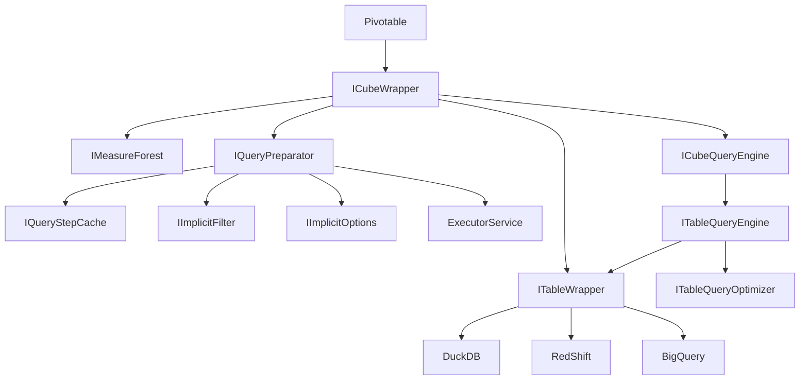
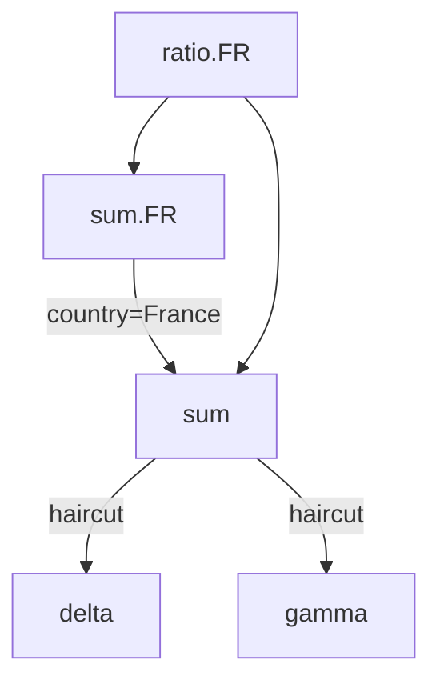

# AdHoc - Formulas for OLAP

[](https://central.sonatype.com/artifact/eu.solven.adhoc/adhoc)
[](https://sonarcloud.io/summary/new_code?id=adhoc)
[](https://sonarcloud.io/summary/new_code?id=adhoc)
[](https://sonarcloud.io/summary/new_code?id=adhoc)
[](https://codecov.io/gh/solven-eu/adhoc)
[](https://renovatebot.com)

## Motivation

Adhoc makes it easy to define/code/review [a la Excel](https://support.microsoft.com/en-us/office/Formulas-and-functions-294d9486-b332-48ed-b489-abe7d0f9eda9) formulas, over a wide range of databases and query engines.

- The formulas define a DAG/Directed-Acyclic-Graph, going from abstract measures to raw data. Intermediate formulas could also be used as measures.
- The DAG should be easily readable and modifiable by a human, not necessarily a developer.
- The DAG can express simple operations like `SUM` or `PRODUCT`, and complex operations like `GROUP BY` or any custom logic. 

Most measures, including intermediate measures, hold a functional meaning. Hence, Adhoc can be seen as a semantic layer, enabling complex formulas over a snowflake SQL/!SQL schema, or a composite of snowflake schemas.


## Products

This repository includes 2 products:

- Adhoc, which is the core project as it holds the query-engine. It is a plain Java library (e.g. no API, no web-server).
- Pivotable, which is a referential web-application around Adhoc. It enables APIs (over [Spring WebFlux](https://docs.spring.io/spring-framework/reference/web/webflux.html)) and a Single-Page-Application (with [VueJS](https://vuejs.org/)).

## Alternative projects

- Excel [Formulas](https://support.microsoft.com/en-us/office/Formulas-and-functions-294d9486-b332-48ed-b489-abe7d0f9eda9). While data are externalized from Adhoc, the tree of measures can be seen as cells referencing themselves through formulas.
- SQLServer Analysis Services [Measures](https://learn.microsoft.com/en-us/analysis-services/tabular-models/measures-ssas-tabular?view=asallproducts-allversions). We rely on many concepts from SQLServer to define our own abstractions.
- Apache Beam. Though [Beam](https://beam.apache.org/) seems less flexible to access intermediate results as intermediate measures.
- MongoDB [Aggregation Pipeline](https://www.mongodb.com/resources/products/capabilities/aggregation-pipeline).
- [DAX](https://learn.microsoft.com/en-us/dax/dax-overview) enables complex queries in Microsoft eco-system.
- [SquashQL](https://www.squashql.io/) is an SQL query-engine for OLAP, with a strong emphasis on its typescript UI.
- [Atoti PostProcessors](https://docs.activeviam.com/products/atoti/server/6.1.1/docs/cube/postprocessors/) is the standard Atoti way of building complex tree of measures on top of Atoti cubes.

### Similar but not drop-in replacement projects

- [Drill](https://drill.apache.org/): much stronger to be queried in SQL by BI Tools. Unclear strategy to define a large tree of measures.
- [Cube.js](https://cube.dev/docs/guides/recipes/data-modeling/filtered-aggregates), but ability to define a large tree of complex measure may not be sustainable.
- [DBT Metrics](https://docs.getdbt.com/docs/build/metrics-overview), but ability to define a large tree of complex measure may not be sustainable.

# Quick-start

## Hardware requirements

RAM: any JVM can run Adhoc, as Adhoc does not store data: it queries on-the-fly the underlying/external tables.
CPU: any JVM can run Adhoc. If multiple cores are available, Adhoc will takes advantage of them. But even a single-core JVM can run Adhoc queries smoothly.

## Set-up

1. Ensure you have JDK 21 available
2. Add a (`maven`/`gradle`) dependency to `eu.solven.adhoc:adhoc:0.0.2` (they are deployed to m2central: https://central.sonatype.com/artifact/eu.solven.adhoc/adhoc)
3. Define an `ITableWrapper`: it defines how Adhoc can access your data

Assuming your data is queryable with JooQ:

```
myTableWrapper = new AdhocJooqTableWrapper(AdhocJooqTableWrapperParameters.builder()
        .dslSupplier(DuckDbHelper.inMemoryDSLSupplier())
        .table(yourJooqTableLike)
        .build());
```

For local `.parquet` files, it can be done with:

```
myTableWrapper = new AdhocJooqTableWrapper(AdhocJooqTableWrapperParameters.builder()
        .dslSupplier(DuckDbHelper.inMemoryDSLSupplier())
        .table(DSL.table(DSL.unquotedName("read_parquet('myRootFolder/2025-*-BaseFacts_*.parquet', union_by_name=True)")))
        .build());
```

4. Define a `MeasureForest`: it defines the measures and the links between them, through their underlying measures.

An early-stage forest could look like:

```
Aggregator k1Sum = Aggregator.builder().name("k1").aggregationKey(SumAggregator.KEY).build();
Aggregator k2Sum = Aggregator.builder().name("k2").aggregationKey(SumAggregator.KEY).build();

Combinator k1PlusK2AsExpr = Combinator.builder()
        .name("k1PlusK2AsExpr")
        .underlyings(Arrays.asList("k1", "k2"))
        .combinationKey(ExpressionCombination.KEY)
        .combinationOptions(ImmutableMap.<String, Object>builder().put("expression", "IF(k1 == null, 0, k1) + IF(k2 == null, 0, k2)").build())
        .build();

MeasureForest.MeasureForestBuilder forestBuilder = MeasureForest.builder();
forestBuilder.addMeasure(k1Sum);
forestBuilder.addMeasure(k2Sum);
forestBuilder.addMeasure(k1PlusK2AsExpr);
```

5. Defines an Adhoc Engine: it know how to execute a query given the measure relationships

```
CubeQueryEngine engine = CubeQueryEngine.builder().eventBus(AdhocTestHelper.eventBus()).forest(forestBuilder.build()).build();
```

6. Define your query

```
ITabularView view = engine.execute(CubeQuery.builder().measure(k1SumSquared.getName()).debug(true).build(), jooqDb);
MapBasedTabularView mapBased = MapBasedTabularView.load(view);

Assertions.assertThat(mapBased.keySet().map(AdhocSliceAsMap::getCoordinates).toList())
        .containsExactly(Map.of());
Assertions.assertThat(mapBased.getCoordinatesToValues())
        .containsEntry(Map.of(), Map.of(k1SumSquared.getName(), (long) Math.pow(123 + 234, 2)));
```

7. Execute your query

# Concepts

## General Architecture



## CubeQuery

An `CubeQuery` is similar to a `SELECT ... WHERE ... GROUP BY ...` SQL statement. It is defined by:

- a list of `groupBy` columns.
- a set of `filter` clauses.
- a list of measures, being either aggregated or transformed measures.



## Table

Adhoc is not a database, it is a query engine. It knows how to execute complex KPI queries, typically defined as complex graph of logics. The leaves of these graphes are pre-aggregated measures, to be provided by external tables.

Typical tables are:

- CSV or Parquet files: Adhoc recommends querying local/remote CSV/Parquet files through [DuckDb](https://duckdb.org/), with the [JooqSqlTable](JooqSqlTable).
- Any SQL table: you should rely on [JooqSqlTable](JooqSqlTable), possibly requiring a [Professional or Enterprise JooQ license](https://www.jooq.org/download/#databases).
- ActivePivot/Atoti
- Your own Database implementing `ITableWrapper`

### Columns

Several different kind of `IAdhocColumn`:

- `ReferencedColumn` are standard columns, as provided by `ITableWrapper` (e.g. some column from some SQL table).
- `EvaluatedExpressionColumn` are columns evaluated given some expression by the `ITableWrapper` (e.g. an SQL like `c AS a || '-' || b` )
- `ICalculatedColumn` are evaluated by the `cube`, given underlying columns. (e.g. an `EvaluatedExpressionColumn` like `a + '-' + b`)
- `IColumnGenerator` are evaluated by the `cube`, providing additional columns and members, independently of other columns. They are typically generated by measures (e.g. a many-to-many measure), and suppressed before reaching the `ITableWrapper`.

The values taken by a column are named coordinates. In similar context, they may be referred to members (e.g. in Analysis Services hierarchies).

### Transcoder

#### Column Transcoding

Given tables may hold similar data but with different column names. A `ITableWrapper` enables coding once per table such a mapping.

A default `ITableWrapper` assumes `ICubeQuery` columns matches the `ITableWrapper` columns.

In case of a table with `JOIN`s, one would often encounter ambiguities when querying a field. For instance when:
- querying a field used in a JOIN definition: the same name may appear in multiple tables
- querying joined tables with `*`, but tables have conflicting field names.

In such a case, one can resolve ambiguities by resolving them in a `ITableWrapper`. For instance:
```java
MapTableTranscoder.builder()
    .queriedToUnderlying("someColumn", "someTable.someColumn")
    .build()
```

#### Value Transcoding

Tables may not all accept query with similar types. Typically, one may filter a column with an `enum` while given `enum` type
may be unknown to the table.

This can be managed with a `ICustomTypeManager`, which will handle type-transcoding on a per-column per-value basis.

## Measures 

A measure can be:
- an aggregated measure (a column aggregated by an aggregation function)
- an transformed measure (one or multiple measures are mixed together, possibly with additional `filter` and/or `groupBys`).

A set of measures defines a Directed-Acyclic-Graph, where leaves are pre-aggregated measures and nodes are transformed measures. The DAG is typically evaluated on a per-query basis, as the CubeQuery `groupBy` and `filter` has to be combined with the own measures `groupBys` and `filters`.

## Node granularity

Measures are evaluated for a slice, defined by the `groupBy` and the `filter` of its parent node. The root node have they `groupBy` and `filter` defined by the CubeQuery.

- Combinator neither change the `groupBy` nor the `filter`.
- Filtrator adds a `filter`, AND-ed with node own `filter`.
- Bucketor adds a `groupBy`, UNION-ed with node own `groupBy`.

### Aggregation Functions

Aggregations are used to reduce input data up to the requested (by `groupBys`) granularity. Multiple aggregation functions may be applied over the same column.

See https://support.microsoft.com/en-us/office/aggregate-function-43b9278e-6aa7-4f17-92b6-e19993fa26df

### Expressions as Aggregations

`ExpressionAggregation` enable custom expression for table processing. 

For instance, in DuckDB, one can use the syntax `SUM("v") FILTER color = 'red'`. It can be used as aggregator:

```
Aggregator.builder()
    .name("v_RED")
    .aggregationKey(ExpressionAggregation.KEY)
    .column("max(\"v\") FILTER(\"color\" in ('red'))")
    .build();
```

### Transformators

On top of aggregated-measures, one can define transformators.

- Combinator: the simplest transformation evaluate a formula over underlying measures. (e.g. `sumMeasure=a+b`).
- Filtrator: evaluate underlying measure with a coordinate when the filter is enforced. The node `filter` is AND-ed with the `measure` filter. Hence, if the query filters `country=France` and the filtrator filters `country=Germany`, then the result is empty.
- Bucketor: evaluates the underlying measures with an additional groupBy, then aggregates up to the node granularity.
- Dispatchor: given an cell, it will contribute into multiple cells. Useful for `many-to-many` or `rebucketing`.

# Many-to-many

In Analysis-Services, [Many-to-Many](https://github.com/MicrosoftDocs/bi-shared-docs/blob/main/docs/analysis-services/multidimensional-models/define-a-many-to-many-relationship-and-many-to-many-relationship-properties.md) is a feature enabling a fact (i.e. an input row) to contribute into multiple coordinate of a given column.

For instance, in a flatten `GeographicalZone` column (e.g. having flattened a hierarchical `Region->Country->City`), a single `Paris` fact would contribute into `Paris`, `France` and `Europe`.

This can be achieved in Adhoc with a `Dispatchor`.

A full example is visible in `TestManyToManyCubeQuery`. It demonstrates how a measure can:

- query underlying measures on fine grained slices (e.g. the input slices of the many-to-many)
- project each of these slices into 0, 1 or N slices (e.g. the output slices of the many-to-many)
- generate its own columns, independently of the underlying table (`IColumnGenerator`). In a many-to-many, the group column is generated by the measure, while the elements are generally generated by the table (or a previous many-to-many).

references:
- [Analysis Services](https://learn.microsoft.com/en-us/analysis-services/multidimensional-models/define-a-many-to-many-relationship-and-many-to-many-relationship-properties)

# Complex Aggregations (e.g. arrays for Value-at-Risk)

For for needs, the aggregation applies not over doubles or longs, but complex objects. For `Value-at-Risk`, the aggregated object is a `double[]` of constant length.

An example for such a use-case is demonstrated in `TestTableQuery_DuckDb_VaR`.

The ability to decompose along the scenarioIndex, or a scenarioName column, which are not defined in the table (which should provide one `double[]` per row) is achieved with a `Dispatchor`. Indeed, it can be seen as a `1-row-to-many-scenarioIndexes`.

# Type Inference

## Ints and Longs

`int`s are generally treated as `long`s.

- Aggregations (e.g. `SUM`) will automatically turns `int` into `long`
- `EqualsMatcher`, `InMatcher` and `ComparingMatcher` will automatically turns `int` into `long`

## Floats and Doubles

`float`s are generally treated as `double`s.

- `SUM` will automatically turns `float` into `double`
- `EqualsMatcher`, `InMatcher` and `ComparingMatcher` will automatically turns `float` into `double`

## Numbers

- Aggregations should generally aggregates as `long`, else `double`.

# Limitations

## Visual filters

Sometimes, one wants to filter the visible members along some columns, without filtering the actual query. Typically, one may want
to query the ratio `France/Europe` by filtering the `France` country, without restricting `Europe` to `France`-only. For now, this can not be easily done.

The underlying issue is that one mah have a column filtering `Country-with_firstLetterIsForG`. Assuming we have a measure returning `currentCountry/Europe`
where `currentCountry` is the country on the `Country` column, if we filter `Country-with_firstLetterIsForG=true` in the query, should we show
`France/(France+Germany)` or `France/Europe`?

## Potential solutions/designs

1. We may introduce a special `groupBy`, where we would express we groupBy `country` but only showing `Country-with_firstLetterIsForG=true`
2. We may introduce a special `filter`, stating that `Country-with_firstLetterIsForG=true` is a `Visual` filter. It resonates with https://learn.microsoft.com/en-us/sql/mdx/visualtotals-mdx?view=sql-server-ver16

# Debug / Investigations

Typical errors with Adhoc are :
- Issue referencing underlying Table columns
- Unexpected data returned by underlying Table

Tools to investigate these issues are:
- Enable `debug` in your query: `CubeQuery.builder()[...].debug(true).build()`
- Enable `explain` in your query: `CubeQuery.builder()[...].explain(true).build()`

## Automated documentation

`ForestAsGraphvizDag` can be used to generate [GraphViz](https://graphviz.org/) `.dot` files given an `IMeasureForest`.

## Debug vs Explain

`StandardQueryOptions.DEBUG` will enable various additional `[DEBUG]` logs with `INFO` logLevel. It may also conduct additional operations (like executing some sanity checks), or enforcing some ordering to facilitate some investigations. It may lead to very poor performances.

`StandardQueryOptions.EXPLAIN` will provide additional information about the on-going query. It will typically log the query executed to the underlying table.

# Tables

At the bottom of the DAG of cubeQuerySteps, the measures are measures evaluated by an external table, applying aggregation functions for given `GROUP BY` and `WHERE` clauses.

Here is an example of such a DAG:

```mermaidjs
graph TB
    cubeQuery[kpiA, kpiB on X by L]
    subgraph user query
      cubeQuery
    end
    cubeQuery --> measureA_cubeContext
    cubeQuery --> measureE_cubeContext
    subgraph cube DAG
      measureA_cubeContext[kpiA on Xby L]
      measureB_cubeContext[kpiB on X by L]
      measureC_cubeContext_v2[kpiC on X by L&M]
      measureD_cubeContext_v3[kpiD on X by L]
      measureE_cubeContext[kpiD on Y by L]
      measureF_cubeContext_v3[kpiD on X&Y by L&M]
    end
    measureA_cubeContext --> measureB_cubeContext
    measureB_cubeContext --> measureC_cubeContext_v2
    measureB_cubeContext --> measureD_cubeContext_v3
    measureE_cubeContext --> measureC_cubeContext_v2
    measureE_cubeContext --> measureF_cubeContext_v3
    subgraph table queries
      tableQuery_tableContext_v2[kpiD on X by L]
      tableQuery_tableContext_v3["kpiC, kpiD(on Y) on X by L&M"]
    end
    measureC_cubeContext_v2 --> tableQuery_tableContext_v3
    measureD_cubeContext_v3 --> tableQuery_tableContext_v2
    measureF_cubeContext_v3 --> tableQuery_tableContext_v3
```

## SQL with JooQ

SQL integration is provided with the help of JooQ. To query a complex star/snowflake schema (i.e. with many/deep joins), one should provide a `TableLike` expressing these `JOIN`s.

For instance:
```java
Table<Record> fromClause = DSL.table(DSL.name(factTable))
        .as("f")
        .join(DSL.table(DSL.name(productTable)).as("p"))
        .using(DSL.field("productId"))
        .join(DSL.table(DSL.name(countryTable)).as("c"))
        .using(DSL.field("countryId"));
```

Such snowflake schema can be build more easily with the help of `JooqSnowflakeSchemaBuilder`.

## Handling null (e.g. from failed JOINs)

See `eu.solven.adhoc.column.IMissingColumnManager.onMissingColumn(String)`

# Authorizations - Rights Management

Right-management is typically implemented by an `AND` operation combining the user `filter` and a filter based on user-rights.

This can be achieved through `IImplicitFilter`. A Spring-Security example is demonstrated in `TestImplicitFilter_SpringSecurity`.

## Common Questions

- How given performance are achieved?

`Adhoc` design delegates most of slow-to-compute sections to the underlying table. And 2020 brought a bunch of very fast database (e.g. DuckDB, RedShift, BigQuery).

- Can `Adhoc` handles indicators based on complex structures like `array` or `struct`?

Most databases handles aggregations over primitive types (e.g. SUM over doubles). `Adhoc` can aggregate any type, given you can implement your own `IAggregation`.

# Data Transfer / Primitive Management

This section does **not** refer to data storage in Adhoc (as, by principle, Adhoc does not store data). But it is about mechanisms used in the library to manage data, especially primitive types.

The general motivation is:

- Prevent boxing/unboxing as much as possible: one should be able to rely on primitive type, especially in critical section of the engine. This enable better performance, and lower GC pressure.
- Focus on `long`, `double` and `Object`. `int` is managed as `long`. `float` is managed as `double`.
- Easy way to rely on plain Objects, until later optimization phases enabling `long` and `double` specific management.

## IValueReceiver

An `IValueReceiver` is subject to receiving data. Incoming data may be a `long`, a `double` or an `Object` (possibly `null`). The `Object` is not guaranteed not to be a `long` or a `double`.

## IValueProvider

An `IValueProvider` is subject to provide data. Outgoing data may be a `long`, a `double` or an `Object` (possibly `null`). The `Object` is not required not to be a `long` or a `double`.

# IOperatorsFactory

The `IOperatorsFactory` is a way to inject custom logic in many places in the application. It is generally oriented towards measures customizations. Specifically, it can create:

- `IAggregation`: typically used by `Aggregator`, it expressed how to merge recursively any number of operands into an operand of similar type. (e.g. `SUM`)
- `IComposition`: typically used by `Combinatator`, it can be seen as an operator over a fixed number of operands. (e.g. `SUBSTRACTION`)
- `IDecomposition`: typically used by `Dispatchor`, it can be seen as an operator splitting an input into a `List` of `IDecompositionEntry` (e.g. `G8=FR+UK+etc`) 
- `IFilterEditor`: typically used by `Filtrator`, it can be seen as an operator mutating an `IAdhocFilter`

# Filtering

A `IAdhocFilter` is a way to restrict the data to be considered on a per-column basis. The set of filters is quite small:

- `AndFilter`: an `AND` boolean operation over underlyings `IAdhocFilter`. If there is no underlying, this is a `.matchAll`.
- `OrFilter`: an `OR` boolean operation over underlyings `IAdhocFilter`. If there is no underlying, this is a `.matchNone`.
- `NotFilter`: an `!` or `NOT` boolean operation over underlying `IAdhocFilter`.
- `IColumnFilter`: an operator over a specific column with given `IValueMatcher`.

A `IValueMatcher` applies to any `Object`. The variety of `IValueMatcher` is quite large, and easily extendible:

- `EqualsMatcher`: true if the input is equal to some pre-defined `Object`.
- `NullMatcher`: true if the input is null.
- `LikeMatcher`: true if the input `.toString` representation matching the registered `LIKE` expression. [www.w3schools.com](https://www.w3schools.com/sql/sql_like.asp)
- `RegexMatcher`: true if the input `.toString` representation matching the registered `regex` expression.
- [etc](https://github.com/search?q=repo%3Asolven-eu%2Fadhoc+%22implements+IValueMatcher%22&type=code)

## Implementing custom operators

Adhoc provides a `StandardOperatorsFactory` including generic operators (e.g. `SUM`). 

- It can refer to custom operators by referring them by their `Class.getName()` as key.
- Your custom `IAggregation`/`ICombination`/`IDecomposition`/`IFilterEditor` should then have:
  - Either an empty constructor
  - Or a `Map<String, ?>` single-parameter constructor.

One may also define a custom `IOperatorsFactory`:

- by extending it
- by creating your own `IOperatorsFactory` and combining with `CompositeOperatorsFactory`
- by adding a fallback strategy with `DummyOperatorsFactory`

## About performance

Humans are generally happier when things goes faster. `Adhoc` enables split-second queries over the underlying table.

The limiting factor in term of performance is generally the under table, which executes aggregations at the granularity requested by Adhoc, induced by the User `GROUP BY`, and those implied by some formulas (e.g. a `Partitionor` by Currency). 

Hence, we do not target absolute performance in `Adhoc`. In other words, we prefer things to remains slightly slower, as long as it enables this project to remains simpler, given a query is generally slow due to the underlying `ITableWrapper`.

Adhoc performances can be improved by:
- Scale horizontally: each Adhoc instance is stateless, and can operate a User-query independently of other shards. There is no plan to enable a single Adhoc query to be dispatched through a cluster on Adhoc instance, but it may be considered if some project would benefit from such a feature.
- Enable caching (e.g. `CubeQueryStep` caching).

### Concurrency

As of `0.0.5`, concurrency is not enabled by default, but it can be enabled through `StandardQueryOptions.CONCURRENT`.

Non-concurrent queries are executed in the calling-thread (e.g. `MoreExecutors.newDirectExecutorService()`).

Concurrent queries are executed in Adhoc own `Executors.newWorkStealingPool`. It can be customized through `AdhocUnsafe.adhocCommonPool`.

Concurrent sections are:

- subQueries in a `CompositeCubesTableWrapper`: each subCube may be queried concurrently.
- `CubeQuerySteps` in a DAG: independent tasks may be executed concurrently.
- tableQueries induced by leaves `CubeQUerySteps`: independent tableQueries may be executed concurrently.

If you encounter a case which performance would be much improved by multi-threading, please report its specificities through a new issue. A benchmark / unitTest demonstrating the case would be very helpful.

`parallelism` can be configured in `AdhocUnsafe.parallelism` or through `-Dadhoc.parallelism=16`.

### Caching

Adhoc enables caching in multiple places. These caches have to be activated manually (e.g. by decorating your `ITableWrapper` with a `CachingTableWrapper`).

Caching as a whole can be disabled with `StandardQueryOptions.NO_CACHE`. It is useful for end-to-end benchmarks, or investigating caching issues.

#### Caching `CubeQuerySteps`

One can add a cache over the results associated to an `CubeQueryStep`. This cache may keep entries associated to any step in a `CubeQueryStep` DAG. Given FIFO principle, if one execute twice the same query, the highest entries from the first query should remain in cache (while lowest entries may be discarded due to cache maximum size) ; hence, second query would be answered right-away, without re-executing the rest of the `CubeQueryStep`.

```
CubeWrapper.builder()
.table(tableWrapper)
.queryPreparator(StandardQueryPreparator.builder().queryStepCache(GuavaQueryStepCache.withSize(1024)).build())
.build();
```

#### Caching `ITableWrapper`

One can add a cache over the `ITableWrapper`. It will keep in cache the output from previous `TableQueries`. This may not lead to expected performances as reading from the cache leads to additional effort (e.g. merging a `ISliceToValue` from the table for one measure, and another from the cache for another measure requires some JOIN operation (e.g. aligning the slices from the 2 distinct `ISliceToValue`), which may not happen if both measures was queried in the same `tableQuery`).

```
ITableWrapper directTableWrapper = ...;
ITableWrapper cachingTableWrapper = CachingTableWrapper.builder().decorated(directTableWrapper).builder();
```

`CachingTableWrapper` can be customized given its `cache` field, which is a plain Guava cache.

# Query Optimizations

Adhoc, as a query engine, has various optimizations regarding its own execution, and how it interacts with `ITableWrapper`.

## `ISliceFilter` optimizations

Given some `ISliceFilter`, these may be automatically optimized into a simpler expression. Typically:
- `a==a1|a:like:a%` is automatically turned into `a:like:a%`

Most of these optimizations are done by `FilterOptimizerHelpers`.

Beware, it is currently difficult to tweak these optimization (neither to add a feature, nor to fix a bug).

`FilterOptimizerHelpers.andNotOptimized` is based on a cost function, to decide when to prefer `!a&!b&!c` over `!(a|b|c)`.

Beware, these optimizations are sensitive as they are used through the engines for various optimizations (e.g. detecting a common `AND` clause between different filters). It is
crucial that such a recombination (e.g. from a common `WHERE` and individual `FILTER`) to produce the exact same (i.e. regarding `hashode/equals`) filter, in order
to get back into the original filter, hence the original `CubeQueryStep`.

## `IValueMatcher` optimizations

Given some `optimizations`, these may be automatically optimized into a simpler expression. Typically:
- `==a1|like:a%` is automatically turned into `like:a%`

Beware, it is currently difficult to tweak these optimization (neither to add a feature, nor to fix a bug).

## `ITableQuery` optimizations

Given a set of `CubeQueryStep` referring an `Aggregator`, these may be grouped together to minimize the number of queries submitted to `ITableWrapper`.

For instance:
- `SUM(a) WHERE f1 AND f2` and `SUM(B) WHERE f1` may be grouped into `SUM(a) FILTER f2, SUM(b) WHERE f1`

It is also possible to change the way queries are grouped together (typically on a per-`GROUP BY` basis) in order to execute less queries (though these queries would query irrelevant information):

```java
CubeWrapper cube = CubeWrapper.builder()
    .name(table.getName())
    .table(table)
    .forest(forest)
    .engine(CubeQueryEngine.builder()
            .tableQueryEngine(TableQueryEngine.builder().optimizerFactory(new ITableQueryOptimizerFactory() {

                @Override
                public ITableQueryOptimizer makeOptimizer(AdhocFactories factories, IHasQueryOptions hasOptions) {
                    if (hasOptions.getOptions().contains(InternalQueryOptions.DISABLE_AGGREGATOR_INDUCTION)) {
                        return new TableQueryOptimizerNone(factories);
                    } else {
                        return new TableQueryOptimizerSinglePerAggregator(factories);
                    }
                }
            }).build())
            .build())
    .build();
```

`TableQueryOptimizerSinglePerAggregator` will merge all `GROUP BY` in a union of columns, and filters into a `OR`. Hence, in a single query, 
it will be able to fetch al lthe necessary information.

For instance:
- Given `SUM(a1) GROUP BY b1 WHERE c1`
- and `SUM(a2) GROUP BY b2 WHERE c2`
- it will query `SUM(a1), SUM(a2) GROUP BY b1, b2 WHERE c1 OR c2`
- If `GROUP BY b1, b2` is dense, and returns `p * q` cells where `p` is `GROUP BY b1` cardinality and `q` is `GROUP BY b2` cardinality, it leads to a query sensibly more complex than the 2 simpler ones.

# ETL (Extract-Transform-Load) emulation

Adhoc does not load data as its result are always based on results from underlying databases/`ITableWrapper`. Still, it may
be necessary to enable data customization similarly to ETL operations.

There is a few options to achieve such behavior.

## Transient JOINs with `JooqTableWrapper`

If you use `JooqTableWrapper` and the underlying database enables transient storage (e.g. like DuckDB), you could add a table and enrich your
JooQ table.

```java
public void createCustomTable(DSLSupplier dslSupplier) {
    DSLContext dslContext = dslSupplier.getDSLContext();

    dslContext.createTable("customTable")
        .column("customKey", SQLDataType.VARCHAR)
        .column("customColumn", SQLDataType.VARCHAR)

        .execute();

    dslContext.connection(c -> {
        DuckDBConnection duckDbC = (DuckDBConnection) c;

        DuckDBAppender appender = duckDbC.createAppender("main", "customTable");
        
        ImmutableMap.builder()
                .put("keyA", "customA")
                .put("keyB", "customB")
                .put("keyC", "customC")
                .build().forEach((key,value) -> {

                  try {
                    appender.beginRow();

                    appender.append(key);
                    appender.append(value);
                    
                    appender.endRow();
                  } catch (SQLException e) {
                    throw new RuntimeException(e);
                  }
                });
    });
}
```

and then add a join to your JooQ table:
```java
public void joinTable(Table baseTable) {
  baseTable.leftJoin(DSL.table("customTable")).on(DSL.field("rawValue").eq(DSL.field("customKey")));
}
```

The column `customColumn` or `"customTable"."customColumn"` can now be referenced as any other column.

## Calculated Column

`ICalculatedColumn` enables

# Roadmap / Limitations to lift soon

## Recent changes

[m2-central](https://central.sonatype.com/artifact/eu.solven.adhoc/adhoc)
Changes: [CHANGES.MD](https://github.com/solven-eu/adhoc/blob/master/CHANGES.MD)

## Limitations

Known limitations would generally trigger a [`NotYetImplementedException`](https://github.com/search?q=repo%3Asolven-eu%2Fadhoc%20NotYetImplementedException&type=code): please open a ticket to report your actual use-case for given scenario.

## Feature Candidates

- [CodeGen] BDD: Automated generation of Scenario given an `ICubeQuery`
- [Feature] Introduce the concept of multiLevel hierarchies, hence implicitly the concept of slicing hierarchies. For now, each hierarchy is optional: no hierarchy is required in groupBy (or implicit on some default member).
- [Explain] Improve `EXPLAIN` behavior when it jumps through components. Typically, it is difficult to follow `EXPLAIN` from a composite-cube to its subQueries.
- [EXPLAIN] Provide metric about memory usage (e.g. footprint from table, footprint for each queryStep)
- [Resiliency] On querySteps errors: a failing measure should not break the whole query.
- [Resiliency] Work on query cancellations/queryTimeouts
- [SECURITY] Ability to hide some measures/columns from some Users
- [Performance] Enable querying multiple `CubeQuery` in a single call, enabling further queryStep sharing for large reports.
- [Composite] `getCoordinates` should be executed once per underlying cube
- [Composite] Enable a failing sub-query not to break the composite query (`StandardQueryOption.EXCEPTIONS_AS_MEASURE_VALUE`)
- [Feature] Enable a measure chain to be automatically injected in the measures DAG.
- [Feature] Break rowspan on right columns
- [Feature] Improve rowspan when very high. Related issue: selecting a rowspan scroll automatically to the top
- [Feature] Enable not adding/stripping some JOINs depending on requested columns/measures/filters.
- [Feature] [Drillthrough](https://datascientest.com/drillthrough-power-bi)
- [Pivotable] Fetch all column details in a single query
- [Pivotable] Clarify pivotable when latest execution failed. May offer to go back to previous working query
- [Feature] Improve CalculatedColumns: remove groupBy from table if calculated, enable filtering, etc.
- [Feature] Identifiers case-insensitivity. Especially columns. See `CubeWrapperTypeTranscoder.mayTranscode(String)` when DB refers to `somecolumn` while a User/Measure refer to `someColumn`. [DuckDB](https://duckdb.org/docs/stable/sql/dialect/keywords_and_identifiers.html)
- [Feature] Record statistics about used measures in storage, for easier re-use.
- [Feature] Investigate recursive hierarchy from flat table (e.g. with JooQ and [suggested design](https://blog.jooq.org/how-to-turn-a-list-of-flat-elements-into-a-hierarchy-in-java-sql-or-jooq/)).
- [Transformator] Introduce a measure enabling to apply some logic along some column, iterating in proper order. (e.g. accumulating some value along a time column).
- [Feature] `EXPLAIN`, when detailing durations, should print in order of execution (e.g. from `Aggregator` to queried measure).
- [Feature] `EXPLAIN`, when detailing durations, should print the delay since the start of the query.
- [Pivotable] Ordering of columns (e.g. a tenor column `3M < 1Y`).
- [Pivotable] Enable browser-back to restore previous query.
- [Feature] `CubeQuery` could enable `filter` and `customValue` per-measure. (Not easy as we may need to alias measures. May add an anonymous `Shiftor`/`Filtrator`).
- [Metrics] Enable coverage on JS given PlayWright tests (https://playwright.dev/docs/api/class-coverage).
- [Concurrency] Prevent `QueryStepRecursiveAction` to request multiple times the same underlying queryStep
- [Performance] Enable `QueryStepCache` to have a policy depending on the time to compute the result. One may want to cache only results which are slow to compute.

# Sponsors

## Profilers

Thanks [EJ Technologies for kindly providing an OpenSource license for JProfiler (their Java Profiler)](https://www.ej-technologies.com/jprofiler).

# Research

- Logic optimization https://en.m.wikipedia.org/wiki/Logic_optimization
  - https://en.m.wikipedia.org/wiki/Quine%E2%80%93McCluskey_algorithm
  - https://en.m.wikipedia.org/wiki/Espresso_heuristic_logic_minimizer
