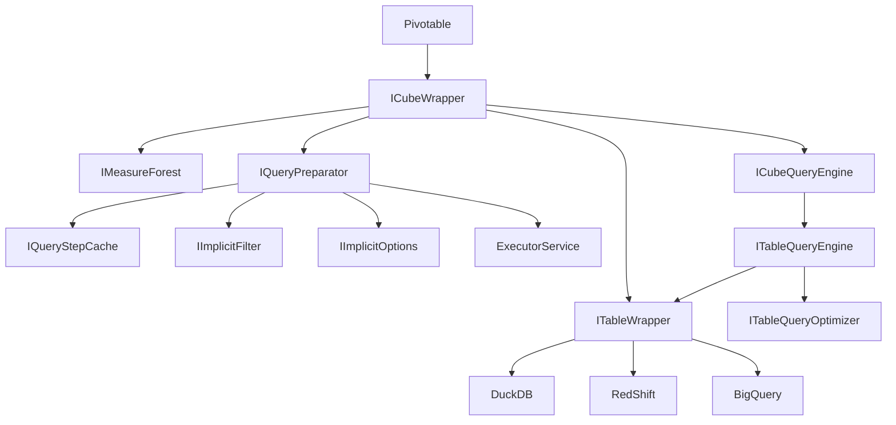
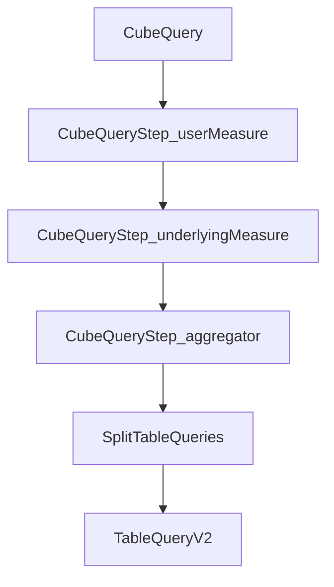
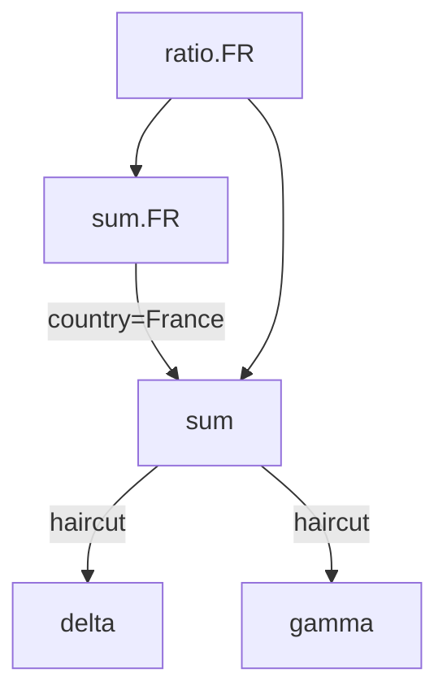

# Concepts

## General Architecture



[Class graph](ARCHITECTURE.mmd)

## General Query Flow



- `CubeQuery --> CubeQueryStep_userMeasure` is mostly managed by `CubeQueryEngine.getRootMeasures(...)`
- `CubeQueryStep_userMeasure --> CubeQueryStep_underlyingMeasure` is mostly managed by `CubeQueryEngine.makeQueryStepsDag(...)`.
- `CubeQueryStep_aggregator --> SplitTableQueries` is mostly managed in `ITableQueryOptimizer.splitInduced(...)`. It build a DAG of `Aggregator-CubeQueryStep`. The roots of this DAG are `inducers`, able to infer `induced`.
- `SplitTableQueries --> TableQueryV2` is mostly managed in `ITableQueryOptimizer.packStepsIntoTableQueries(...)`. It defines `TableQueryV2` able to infer the `inducers`.`

## CubeQuery

An `CubeQuery` is similar to a `SELECT ... WHERE ... GROUP BY ...` SQL statement. It is defined by:

- a list of `groupBy` columns.
- a set of `filter` clauses.
- a list of measures, being either aggregated or transformed measures.



## Table

Adhoc is not a database, it is a query engine. It knows how to execute complex KPI queries, typically defined as complex graph of logics. The leaves of these graphes are pre-aggregated measures, to be provided by external tables.

Typical tables are:

- CSV or Parquet files: Adhoc recommends querying local/remote CSV/Parquet files through [DuckDb](https://duckdb.org/), with the [JooqTableWrapper](JooqTableWrapper).
- Any SQL table: you should rely on [JooqTableWrapper](JooqTableWrapper), possibly requiring a [Professional or Enterprise JooQ license](https://www.jooq.org/download/#databases).
- ActivePivot/Atoti
- Your own Database implementing `ITableWrapper`

### Columns

Several different kind of `IAdhocColumn`:

- `ReferencedColumn` are standard columns, as provided by `ITableWrapper` (e.g. some column from some SQL table).
- `EvaluatedExpressionColumn` are columns evaluated given some expression by the `ITableWrapper` (e.g. an SQL like `c AS a || '-' || b` )
- `ICalculatedColumn` are evaluated by the `cube`, given underlying columns. (e.g. an `EvaluatedExpressionColumn` like `a + '-' + b`)
- `IColumnGenerator` are evaluated by the `cube`, providing additional columns and members, independently of other columns. They are typically generated by measures (e.g. a many-to-many measure), and suppressed before reaching the `ITableWrapper`.

The values taken by a column are named coordinates. In similar context, they may be referred to members (e.g. in Analysis Services hierarchies).

### Transcoder

#### Column Transcoding

Given tables may hold similar data but with different column names. A `ITableWrapper` enables coding once per table such a mapping.

A default `ITableWrapper` assumes `ICubeQuery` columns matches the `ITableWrapper` columns.

In case of a table with `JOIN`s, one would often encounter ambiguities when querying a field. For instance when:
- querying a field used in a JOIN definition: the same name may appear in multiple tables
- querying joined tables with `*`, but tables have conflicting field names.

In such a case, one can resolve ambiguities by resolving them in a `ITableWrapper`. For instance:

```java
MapTableAliaser.builder()
	.queriedToUnderlying("someColumn", "someTable.someColumn")
	.build()
```

#### Value Transcoding

Tables may not all accept query with similar types. Typically, one may filter a column with an `enum` while given `enum` type
may be unknown to the table.

This can be managed with a `ICustomTypeManager`, which will handle type-transcoding on a per-column per-value basis.

## Measures

A measure can be:
- an aggregated measure (a column aggregated by an aggregation function)
- an transformed measure (one or multiple measures are mixed together, possibly with additional `filter` and/or `groupBys`).

A set of measures defines a Directed-Acyclic-Graph, where leaves are pre-aggregated measures and nodes are transformed measures. The DAG is typically evaluated on a per-query basis, as the CubeQuery `groupBy` and `filter` has to be combined with the own measures `groupBys` and `filters`.

## Node granularity

Measures are evaluated for a slice, defined by the `groupBy` and the `filter` of its parent node. The root node have they `groupBy` and `filter` defined by the CubeQuery.

- Combinator neither change the `groupBy` nor the `filter`.
- Filtrator adds a `filter`, AND-ed with node own `filter`.
- Partitionor adds a `groupBy`, UNION-ed with node own `groupBy`.

### Aggregation Functions

Aggregations are used to reduce input data up to the requested (by `groupBys`) granularity. Multiple aggregation functions may be applied over the same column.

See https://support.microsoft.com/en-us/office/aggregate-function-43b9278e-6aa7-4f17-92b6-e19993fa26df

### Expressions as Aggregations

`ExpressionAggregation` enable custom expression for table processing.

For instance, in DuckDB, one can use the syntax `SUM("v") FILTER color = 'red'`. It can be used as aggregator:

```
Aggregator.builder()
	.name("v_RED")
	.aggregationKey(ExpressionAggregation.KEY)
	.column("max(\"v\") FILTER(\"color\" in ('red'))")
	.build();
```

### Transformators

On top of aggregated-measures, one can define transformators.

- Combinator: the simplest transformation evaluate a formula over underlying measures. (e.g. `sumMeasure=a+b`).
- Filtrator: evaluate underlying measure with a coordinate when the filter is enforced. The node `filter` is AND-ed with the `measure` filter. Hence, if the query filters `country=France` and the filtrator filters `country=Germany`, then the result is empty.
- Partitionor: evaluates the underlying measures with an additional groupBy, then aggregates up to the node granularity.
- Dispatchor: given an cell, it will contribute into multiple cells. Useful for `many-to-many` or `rebucketing`.

