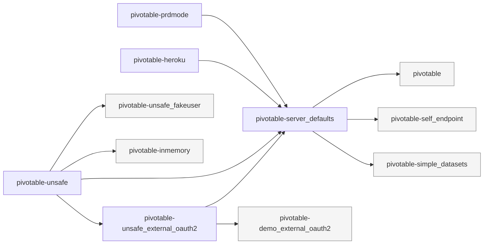

# FAQ — Recurrent cases

A non-exhaustive list of common questions and one (or more) solutions. This page is meant to grow
over time: when a question comes up repeatedly, add it here with a short, actionable answer and
pointers to the relevant reference pages.

## Columns

### How can I manage a column used by a measure, but missing in the database?

When a measure (or an aggregator) references a column that does not exist in the underlying
`ITableWrapper`, the table query will fail because Adhoc asks for a column the database does not
know about.

**Simple solution — register a `FunctionCalculatedColumn` with a constant value on the
`ColumnsManager`.**

```java
FunctionCalculatedColumn missingAsConstant = FunctionCalculatedColumn.builder()
		.name("missingColumn")
		.type(String.class)
		.recordToCoordinate(record -> "defaultValue")
		.build();

ColumnsManager columnsManager = ColumnsManager.builder()
		.calculatedColumn(missingAsConstant)
		.build();
```

The calculated column is evaluated per-row right after the `ITableWrapper` returns, so every row
looks as if the table had a `missingColumn` column holding `"defaultValue"`. Measures, filters and
GROUP BYs then see the column like any other.

**Alternative — register an `IColumnGenerator` manually on the `ColumnsManager`.**

`ColumnsManager.builder().columnGenerator(...)` accepts a single `IColumnGenerator`. Unlike
`ICalculatedColumn`, an `IColumnGenerator` advertises a set of column names and types through
`getColumnTypes()` without being wired to a specific `Dispatchor` measure; use this when the
missing column must be reported in the cube schema (`cube.getColumns()`) even though no
per-record evaluation logic is required. The two mechanisms are redundant today and are
expected to converge — see the TODO near `ColumnsManager.columnGenerator` / `calculatedColumns`.

**When to pick another approach:**

- If the value must depend on other columns of the row, use a regular `FunctionCalculatedColumn`
  that reads from the `ITabularGroupByRecord` — see [Calculated Columns](calculated-columns.md).
- If the value should be authored as a string expression (e.g. by a UI user), use
  `EvaluatedExpressionColumn` instead.
- If several rows must be produced from one (EXPLODE semantics), use an `IDecomposition` via a
  `Dispatchor` — see [Many-to-many](many-to-many.md).

See [Calculated Columns](calculated-columns.md) for the full reference.

## Pivotable

### Why does my Pivotable login page show `GitHub` and `Google` as OAuth2 providers? How do I disable them?

The Pivotable login page renders one button per OAuth2 client that Spring Security knows about. The
`GitHub` and `Google` entries are wired in
[`application-pivotable-demo_external_oauth2.yml`](https://github.com/solven-eu/adhoc/blob/master/pivotable/server/src/main/resources/application-pivotable-demo_external_oauth2.yml),
which is activated by the `pivotable-demo_external_oauth2` Spring profile (commonly bundled with
the `pivotable-unsafe` local-dev stack). The buttons themselves are produced by
[`PivotableLoginWebnoneController.loginProviders()`](https://github.com/solven-eu/adhoc/blob/master/pivotable/server/src/main/java/eu/solven/adhoc/pivotable/webnone/api/PivotableLoginWebnoneController.java),
which iterates every registered `ClientRegistration` and exposes it to the SPA via
`GET /api/login/v1/providers`.

**To hide every OAuth2 provider at once:**

```yaml
adhoc.pivotable.login.oauth2.enabled: false
```

The controller short-circuits the registration scan when this flag is `false` — the SPA then only
sees the BASIC `fakeuser` button (when the `pivotable-unsafe_fakeuser` profile is active) or no
provider at all.

**To hide a single provider:**

```yaml
adhoc.pivotable.login.oauth2.github.enabled: false
adhoc.pivotable.login.oauth2.google.enabled: false
```

The `<registrationId>.enabled` flag is checked per `ClientRegistration` — the underlying Spring
Security wiring stays intact (so a programmatic client could still use it), only the SPA button
is suppressed.

The matching property constant is `IPivotableLoginConstants.P_OAUTH2`
(`adhoc.pivotable.login.oauth2.enabled`).

### How are the Pivotable Spring profiles wired together?

The activatable profiles are declared as
[`spring.profiles.group` entries](https://docs.spring.io/spring-boot/reference/features/profiles.html#features.profiles.groups)
in
[`pivotable-config.yml`](https://github.com/solven-eu/adhoc/blob/master/pivotable/server/src/main/resources/pivotable-config.yml).
Activating a profile transitively activates every profile listed under its group entry, so
e.g. `pivotable-unsafe` pulls in the OAuth2 demo wiring without you naming it explicitly.



Reading the graph: an arrow `A → B` means "activating `A` also activates `B`". Leaf nodes (grey)
are not themselves groups — they carry the actual `application-<name>.yml` configuration.

Two practical consequences worth remembering:

- **`pivotable-unsafe` (local-dev default) silently activates `pivotable-demo_external_oauth2`** —
  that's where the GitHub / Google OAuth2 client registrations come from (see the previous FAQ
  entry for how to disable them).
- **Adding a transitive `include` is safe; adding a top-level `spring.profiles.active` default is
  not** — see the comment at the top of `pivotable-config.yml`: a default `active` would suppress
  the otherwise-implicit `default` profile.

If this graph drifts (new profile groups added), regenerate it by re-reading
`pivotable/server/src/main/resources/pivotable-config.yml`: every `<key>: [<child>, ...]` block
under `spring.profiles.group` becomes one `<key> --> <child>` arrow per child.

### Spring Boot config precedence — and the library-defaults pattern we use

**Order, low → high** (later entries override earlier ones — abridged from the
[Spring Boot reference](https://docs.spring.io/spring-boot/reference/features/external-config.html)):

1. **Java-side defaults** — `@ConfigurationProperties` field initializers, or
   `env.getProperty(key, type, defaultValue)` fallbacks. Lowest priority.
2. `application.yml` / `application.properties` — the base file shipped by the application.
3. Profile-specific `application-<profile>.yml` files, in activation order.
4. OS environment variables.
5. Java system properties (`-Dkey=value`).
6. Command-line arguments (`--key=value`). Highest priority.

**Pivotable's library-defaults rule**: when this code ships as a library, defaults belong in
**Java** so any downstream `application.yml` override naturally wins. The two patterns in use:

- `@ConfigurationProperties` field initializers — see `PivotableChatProperties.enabled = true`.
- `env.getProperty(key, type, true)` fallback — see
  [`PivotableLoginWebnoneController.loginProviders()`](https://github.com/solven-eu/adhoc/blob/master/pivotable/server/src/main/java/eu/solven/adhoc/pivotable/webnone/api/PivotableLoginWebnoneController.java)
  for `adhoc.pivotable.login.oauth2.enabled`.

**Opt-in profile yaml files** (e.g. `application-pivotable-demo_external_oauth2.yml`) should
carry **only** the structural wiring that's hard to express in Java (the
`spring.security.oauth2.client.registration.*` block in this case). Any *behavioral* default
written into a profile yaml beats the downstream user's `application.yml` once the profile is
active — a silent override that's surprising and hard to debug. The default-value reference is
instead kept as a **commented block** in the same file, so the keys are discoverable without
participating in the precedence chain. See the trailing comment in
[`application-pivotable-demo_external_oauth2.yml`](https://github.com/solven-eu/adhoc/blob/master/pivotable/server/src/main/resources/application-pivotable-demo_external_oauth2.yml).

**If a value still won't take**, walk the precedence chain in reverse:

- `--key=value` on the command line beats every yaml.
- `KEY=value` env var beats every yaml.
- A custom profile yaml `application-myprofile.yml` activated AFTER the offending one
  (`SPRING_ACTIVE_PROFILES=pivotable-unsafe,myprofile`) — later-listed profiles override earlier
  ones.

## See also

- [Calculated Columns](calculated-columns.md)
- [Tables](tables.md)
- [Debug / Investigations](debug.md)

