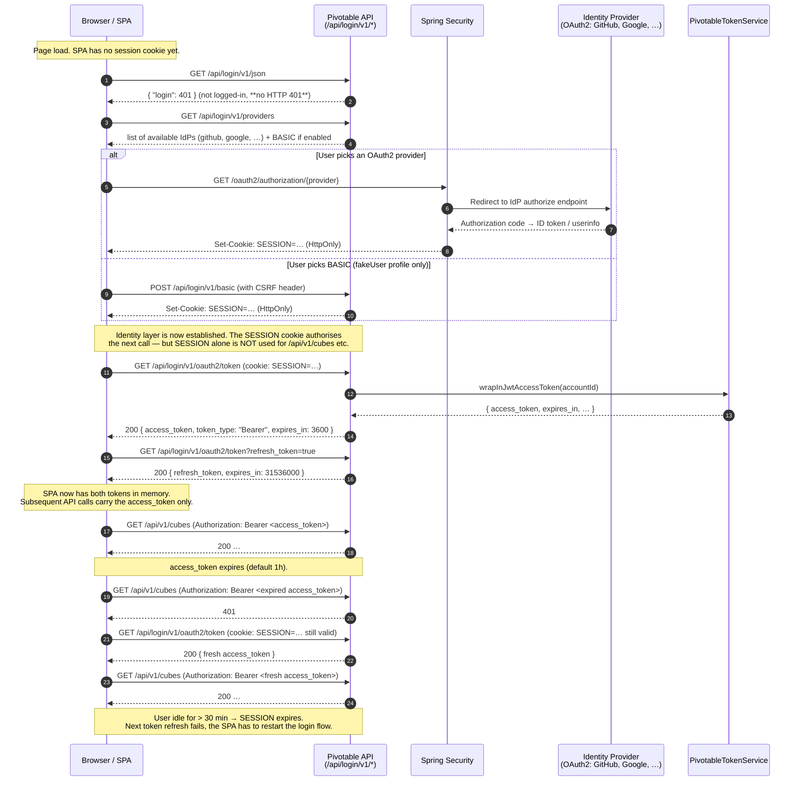

# Pivotable Security Model

Pivotable is an SPA (Vue.js) over a REST API (Spring WebFlux or Spring WebMVC) over
the [Adhoc](index.md) query engine. This document describes how the SPA authenticates
the user, how the browser obtains a credential it can attach to API calls, and how
the lifetimes of the different tokens interact.

The short version: **two layers of auth**.

|                       Layer                        |                       Mechanism                       |                      Lifetime                       |            Carried by            |
|----------------------------------------------------|-------------------------------------------------------|-----------------------------------------------------|----------------------------------|
| 1. Identity (who the user is)                      | Spring Security session, seeded by BASIC / OAuth2 / … | Sliding idle timeout (default 30 min of inactivity) | `SESSION` cookie (HttpOnly)      |
| 2. API access (what the SPA attaches to each call) | Applicative JWT, minted and signed by Pivotable       | Fixed — default `PT1H` (access) / `P365D` (refresh) | `Authorization: Bearer …` header |

The two layers are independent. The identity layer bootstraps the first JWT; after
that, every API call only needs the JWT. The session is only consulted again when the
JWT expires and the SPA asks for a fresh one.

## Why two layers?

Pivotable can delegate login to third-party identity providers (GitHub, Google, …)
that themselves return an OAuth2 token. That token is **not** used to call the
Pivotable API — it is used once, at login time, to establish **who** the user is.
Once the identity is established, Pivotable mints its own JWT (signed with its own
key, see `IPivotableOAuth2Constants.KEY_JWT_SIGNINGKEY`) and that JWT is what the
SPA actually attaches to `/api/*` calls.

Concrete benefits of minting a Pivotable-specific token:

- The API boundary has a single, uniform bearer format regardless of how the user
  logged in (BASIC fakeUser, GitHub, Google, …).
- Pivotable controls the lifetime, the audience claim (`"Pivotable-Server"`), the
  subject (Pivotable's internal `accountId`), and the revocation story (`jti`).
- The upstream IdP token never leaks to the browser JavaScript — it stays in the
  server-side session.

## The login flow



## Routes involved

All Pivotable-specific login routes live under `/api/login/v1/`. Spring Security
additionally registers a few root-level routes (`/oauth2/authorization/{provider}`,
`/logout`).

|                        Route                        |      Auth required       |                                                                                                                                                                                                                                                          Purpose                                                                                                                                                                                                                                                          |
|-----------------------------------------------------|--------------------------|---------------------------------------------------------------------------------------------------------------------------------------------------------------------------------------------------------------------------------------------------------------------------------------------------------------------------------------------------------------------------------------------------------------------------------------------------------------------------------------------------------------------------|
| `GET /api/login/v1/providers`                       | No                       | List of IdP providers available on this deployment. Public so the SPA can render the login screen before anyone is logged in.                                                                                                                                                                                                                                                                                                                                                                                             |
| `GET /api/login/v1/json`                            | No                       | Returns `{ "login": 200, "session": {…} }` if the caller has a valid session, `{ "login": 401 }` otherwise. Never returns HTTP 401 — this is important: it lets the SPA probe login state without tripping a global `401 → redirect-to-login` interceptor. The `session` sub-map exposes the sliding-idle lifetime: `maxIdleSeconds`, `creationEpochMs`, `lastAccessEpochMs` — so the SPA can render "session idles out in N seconds" without having to read the HttpOnly `SESSION`/`JSESSIONID` cookie (which it can't). |
| `GET /api/login/v1/html`                            | —                        | HTTP 302 to the login page or to `?success`, depending on current auth state. Used by templated HTML flows.                                                                                                                                                                                                                                                                                                                                                                                                               |
| `GET /oauth2/authorization/{provider}`              | No (starts the flow)     | Spring Security entry point that redirects to the IdP.                                                                                                                                                                                                                                                                                                                                                                                                                                                                    |
| `POST /api/login/v1/basic`                          | No (creates the session) | BASIC login. Only enabled under the `fakeUser` profile — this is a local-dev convenience, **not** a production mechanism.                                                                                                                                                                                                                                                                                                                                                                                                 |
| `GET /api/login/v1/csrf`                            | No                       | Returns the CSRF token (header name in the body, token value in the response header). Must be called before any state-changing request.                                                                                                                                                                                                                                                                                                                                                                                   |
| `GET /api/login/v1/user`                            | SESSION                  | Returns the current `PivotableUserRaw`.                                                                                                                                                                                                                                                                                                                                                                                                                                                                                   |
| `POST /api/login/v1/user`                           | SESSION                  | Updates mutable user fields (e.g. `countryCode`).                                                                                                                                                                                                                                                                                                                                                                                                                                                                         |
| `GET /api/login/v1/oauth2/token`                    | SESSION                  | Mints a **Pivotable** JWT `access_token`. Default lifetime `PT1H` (`IPivotableOAuth2Constants.DEFAULT_ACCESS_TOKEN_VALIDITY`).                                                                                                                                                                                                                                                                                                                                                                                            |
| `GET /api/login/v1/oauth2/token?refresh_token=true` | SESSION                  | Mints a long-lived JWT `refresh_token`. Default lifetime `P365D`. The refresh_token is itself a signed JWT carrying a `refresh_token: true` claim.                                                                                                                                                                                                                                                                                                                                                                        |
| `GET /api/login/v1/logout`                          | SESSION                  | Returns `{ "Location": "/html/login?logout" }`. The 2xx-with-Location pattern is used because the `fetch` API cannot intercept 3xx redirects.                                                                                                                                                                                                                                                                                                                                                                             |
| `POST /logout`                                      | SESSION (+ CSRF)         | Spring Security default: invalidates the session and clears the cookie.                                                                                                                                                                                                                                                                                                                                                                                                                                                   |
| `GET /api/v1/**`                                    | Bearer JWT               | Every functional API (cubes, queries, …). Rejects with 401 if no valid access_token is present.                                                                                                                                                                                                                                                                                                                                                                                                                           |

## Token and session lifetimes

```
access_token (JWT)    ├──────────────┤                                    1 hour (PT1H, configurable)
refresh_token (JWT)   ├──────────────────────────────────────────────┤    365 days (P365D, configurable)
SESSION (cookie)      ├── sliding ──+ sliding ──+ sliding ──+ …           30 min since last activity
```

- `access_token` lifetime is **fixed from issue time**. Configurable via
  `adhoc.pivotable.oauth2.access-token.validity` (ISO-8601 duration).
- `refresh_token` lifetime is also **fixed from issue time**. Configurable via
  `adhoc.pivotable.oauth2.refresh-token.validity`.
- The `SESSION` cookie lifetime is **sliding**: every request reached through a
  valid session resets the idle clock. The cookie itself is a `HttpOnly` opaque id
  backed by Spring WebFlux's `InMemoryWebSessionStore` (default) — its value carries
  no user information, so JavaScript cannot inspect when it will expire.

### e2e testing with short lifetimes

For tests that want to exercise the real refresh round-trip in seconds instead of
hours, enable the `pivotable-e2e-shorttoken` profile — it sets access to `PT3S` and
refresh to `PT30S`:

```bash
SPRING_ACTIVE_PROFILES=pivotable-unsafe,pivotable-e2e-shorttoken \
mvn -f pivotable/server-webflux/pom.xml -Pfast spring-boot:run
```

Or from `pivotable/js/`:

```bash
npm run backend_shorttoken
```

## Typical failure modes

|                       Symptom                       |                                     Root cause                                      |                                                           Remediation                                                            |
|-----------------------------------------------------|-------------------------------------------------------------------------------------|----------------------------------------------------------------------------------------------------------------------------------|
| Every `/api/*` returns 401                          | access_token expired and the SPA did not refresh in time                            | SPA's token store watches `expires_at` and refreshes preemptively (see `store-user.js#loadUserTokensIfMissing`)                  |
| Token refresh returns 401                           | SESSION idled out (> 30 min inactive)                                               | User must re-login. The SPA sets `needsToLogin = true` and redirects to `/html/login`.                                           |
| JWT verification rejects a pre-restart token        | Backend restart regenerated the signing key (default when `signing-key = GENERATE`) | A single re-login mints a token signed by the new key. Pin the key via `adhoc.pivotable.oauth2.signing-key` to survive restarts. |
| Logout POST returns HTML instead of JSON (dev only) | Vite dev proxy not forwarding `/logout`                                             | Ensure `/logout` is listed in `vite.config.js` → `server.proxy`                                                                  |

## Rights management

Once the user is authenticated and the JWT is accepted, **what** they can see is
governed by [Authorizations](authorizations.md) — Pivotable injects an
`IImplicitFilter` into every query so that data is filtered based on the
authenticated user's rights.

The security model described here is only about **authentication** (who are you?)
and **API access** (are you allowed to call `/api/*`?); per-row / per-cube rights are
applied downstream inside the query engine.
